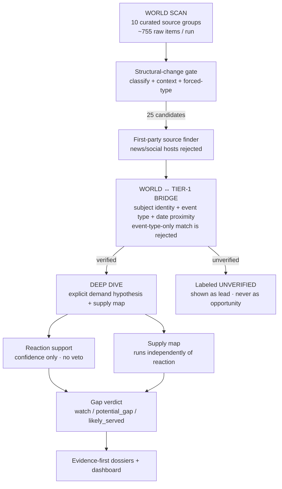

# GapRadar

**GapRadar watches structural changes in the world, verifies which ones are real against first-party sources, converts them into explicit demand hypotheses, maps replacement supply, and surfaces only evidence-backed market gaps for human review.**

It is **not** an "AI startup idea generator". It is an evidence-first market-intelligence radar for people who make high-stakes decisions: corporate strategy, business development, market research, venture investing, and product planning.

A news headline is a lead. A verified first-party change plus an explicit demand hypothesis and a supply map is an opportunity. GapRadar never confuses the two.

---

## Live pipeline status

These are real numbers from the latest automated run, regenerated every six hours by GitHub Actions (see [`data/`](data/) for the full JSON).

| Metric | Value | Notes |
| --- | --- | --- |
| World sources healthy | **10 / 10** | 0 failed |
| Raw items scanned | **755** | 77 recent-entries after dedup window |
| Structural-change candidates | **25** | after classify + context gate |
| Tier-1 verified this run | **1** | UK government clean-electricity regulatory shift — matched to a first-party `gov.uk` page |
| Deep dives | 1 | demand hypothesis + supply map run |
| Blind discovery benchmark | **precision 0.9412 · recall 0.8889** | 24-case shuffled noisy stream, seed 620 |

The pipeline is deliberately strict: most candidates stay **UNVERIFIED** and are surfaced as world-change leads only, never as verified opportunities. A run with zero gaps is a valid result.

---

## How it works



The two most important design decisions:

**1. Discovery and verification are separate processes.** `worldscan.py` finds broad structural change. `worldverify.py` bridges those leads to already-verified Tier-1 events — and requires subject identity evidence (vendor/product overlap, headline overlap, date proximity). Matching only on "both are shutdowns" is explicitly rejected.

**2. Reaction evidence never has veto power.** Once an event is Tier-1 verified and has an explicit demand hypothesis, supply analysis runs immediately. Hacker News, GitHub Issues, Reddit and forums can raise or lower confidence, but they cannot decide whether the market-coverage investigation is allowed to exist. The most valuable opportunities often appear before public discussion becomes obvious.

---

## Evidence hierarchy

| Tier | Purpose | Examples | Can verify the event? |
| --- | --- | --- | --- |
| **Tier 1 — Official** | Establish the fact | vendor changelog, company announcement, regulator/government page | **Yes** |
| **Tier 2 — Reaction** | Adjust demand confidence | HN, GitHub Issues, Reddit, forums, communities | No |
| **Tier 3 — Supply** | Assess whether the job is already served | GitHub, npm, products, vendors, solution providers | No |

**No Tier-1 source = no verified event.** A news article can be useful discovery evidence, but it can never manufacture a verified market gap by itself.

### Demand hypothesis

Every verified event must expose an explicit, falsifiable `DemandHypothesis`:

- affected users;
- job to be done;
- disruption created by the change;
- official successor / migration path when known;
- evidence basis;
- confidence: `low` / `medium` / `high`;
- unresolved unknowns.

Supported structural-change classes:

- shutdown / end-of-life;
- price shock / free-tier removal;
- API / platform / terms / licensing change;
- regulatory shift creating mandatory work.

The hypothesis is allowed to be wrong. Hidden inference is not.

### Supply analysis

Supply runs for **every verified event + explicit demand hypothesis**, even when reaction evidence is absent.

Supply states: `unassessed` · `no_supply` · `thin_supply` · `served`
Gap states: `unassessed` · `watch` · `potential_gap` · `likely_served`

- verified hypothesis + supply unassessed → no gap verdict;
- thin/no supply + weak or no reaction → `watch`;
- thin/no supply + repeated reaction → `potential_gap`;
- strong replacement supply → `likely_served` even if reaction is silent.

Silence is valid. A day with zero gaps can be correct.

---

## Benchmarks: what they do and do not prove

GapRadar keeps three benchmarks because they answer different questions.

### 1. Verification fixture benchmark
Historical official documents are provided to the detector. This measures classification/verification logic, **not** open-web discovery. ~94% precision/recall on the curated fixture must **not** be presented as "GapRadar finds 94% of real opportunities on the internet".

### 2. Wayback replay
Attempts to retrieve archived first-party pages. Archive failure is reported separately and never converted into a detector miss. Low Wayback coverage is infrastructure evidence, not proof of market recall.

### 3. Blind noisy-stream benchmark
Positive historical cases and negative controls are shuffled into **one stream** and passed through the WORLD SCAN gate without telling the scanner which rows are positives. Current result: **precision 0.9412 / recall 0.8889 / event-type accuracy 0.8125** (24 cases, seed 620).

This is stricter than the verification fixture, but it is still an offline historical corpus — **not yet proof of all-web retrieval recall**. The next hard benchmark is a true archived/live noisy stream where the correct event URLs are not preselected.

---

## Current coverage boundary

WORLD SCAN watches broad queries across: AI & Technology · Energy & Climate · Healthcare & Biotech · Finance & Fintech · Mobility · Industry & Robotics · Consumer & Society · Frontier.

The precision-first configured official feed detector is deliberately narrower than the discovery layer. That is an explicit engineering boundary, not something the product hides.

---

## Quick start

The analysis engine requires Python 3.11+.

```bash
python -m venv .venv
source .venv/bin/activate
python -m pip install -e '.[dev]'
pytest

gapradar world-scan
gapradar doctor
gapradar scan
gapradar world-verify
gapradar validate-demand
gapradar validate-supply
gapradar build-dossiers
gapradar blind-backtest
gapradar export
python -m http.server 8000 --directory docs
```

Open <http://localhost:8000/docs/index.html>.

The `data/` directory contains real pipeline output (`world-gaps.json`, `world-verifications.json`, `world-assessments.json`, `world-scan-stats.json`) so you can inspect what an evidence-first run actually produces before touching the network.

---

## Automated live chain

GitHub Actions runs the full radar every six hours:

```text
WORLD SCAN
→ FIRST-PARTY SOURCE CANDIDATES
→ OFFICIAL SOURCE HEALTH
→ LIVE TIER-1 SCAN
→ WORLD ↔ TIER-1 BRIDGE
→ DEEP-DIVE VERIFIED WORLD LEADS ONLY
→ REACTION SUPPORT
→ SUPPLY MAP (independent of reaction)
→ DOSSIERS
→ BLIND DISCOVERY BENCHMARK
→ DASHBOARD EXPORT
```

Unverified world leads are intentionally blocked from deep gap analysis.

---

## Guardrails

1. No official source, no verified event.
2. WORLD SCAN candidates are leads, not facts.
3. A "first-party source candidate" is not automatically Tier-1 verified.
4. Discovery confidence and opportunity confidence are separate.
5. Every verified event must expose an explicit demand hypothesis before a market-gap judgment.
6. Demand hypotheses may be low-confidence; uncertainty must stay visible.
7. Reaction evidence adjusts confidence; it never gates hypothesis creation or supply analysis.
8. Failed reaction search cannot become proof of no demand.
9. `no_signal` means "not detected by these queries", never "no demand exists".
10. Popular software is not replacement supply unless it is relevant to the affected job.
11. Strong replacement supply can mark a hypothesis `likely_served` even with no reaction.
12. Unverified WORLD SCAN leads may not enter deep gap analysis.
13. `REVIEW` requires stronger evidence than `WATCH`; missing evidence is never invented.
14. Dossiers do not fabricate market size, revenue forecasts, opportunity scores, or build windows.
15. Archive failure is archive failure, not detector failure.
16. Fixture accuracy is benchmark accuracy, not market-wide discovery accuracy.
17. Historical benchmark rules may not silently weaken live precision.

---

## Repository layout

```text
config/world_sources.yml       broad world/news discovery sources
config/sources.yml             configured first-party verification sources
src/gapradar/worldscan.py      broad noisy world-change discovery
src/gapradar/officialfinder.py conservative first-party source candidate search
src/gapradar/worldverify.py    WORLD candidate ↔ Tier-1 event bridge
src/gapradar/detector.py       precision-first first-party event verification
src/gapradar/models.py         demand hypothesis + evidence + state machine
src/gapradar/reaction.py       supporting reaction evidence
src/gapradar/supply.py         supply search, independent of reaction
src/gapradar/worlddeep.py      supply/gap analysis for verified world leads
src/gapradar/dossier.py        evidence-first opportunity dossier
src/gapradar/backtest.py       historical verification replay
src/gapradar/blindbacktest.py  shuffled noisy-stream discovery benchmark
src/gapradar/discovery.py      downstream historical self-discovery benchmark
src/gapradar/render.py         dashboard renderer
src/gapradar/cli.py            radar commands
data/world-gaps.json           broad world candidates (live)
data/world-official-leads.json first-party source candidates (live)
data/world-verifications.json  Tier-1 bridge results (live)
data/world-assessments.json    verified-world-lead deep dives (live)
data/events.json               verified events + hypotheses + evidence
data/dossiers.json             dossier index
data/world-scan-stats.json     per-run scan metrics (live)
.github/workflows/radar.yml    six-hour automated pipeline
```

---

## Roadmap

- **V0.1** — Hard-event skeleton ✅
- **V0.2** — Precision-first live radar ✅
- **V0.3** — Reaction evidence ✅
- **V0.4** — Supply analysis ✅
- **V0.5** — Opportunity dossier ✅
- **V0.6** — Auditable evidence search ✅
- **V0.7** — Historical verification benchmark ✅
- **V0.8** — World discovery + explicit demand hypotheses + Tier-1 bridge + reaction-independent supply + blind-stream benchmark 🚧
- **V0.9** — Automatic first-party verification across materially broader sectors + true archived/live noisy-stream retrieval benchmark
- **V1.0** — Reliable Event → Demand → Supply → Gap intelligence loop validated by professional users

## License

MIT © 2026 Amazing Kimi
